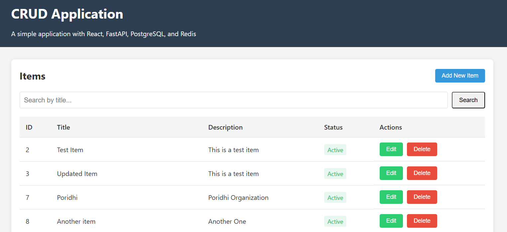

# Full-Stack CRUD Application with React, FastAPI, PostgreSQL, and Redis

## Project Overview

This project is a modern full-stack application that implements complete CRUD (Create, Read, Update, Delete) functionality. The application is containerized using Docker, making it easy to deploy and run in any environment.



### Technology Stack

- **Frontend**: React.js
- **Backend**: FastAPI (Python)
- **Database**: PostgreSQL
- **Caching**: Redis
- **Containerization**: Docker & Docker Compose
- **Web Server**: Nginx (for production builds)

### Key Features

- Complete CRUD operations for managing items
- RESTful API with JSON responses
- Database-backed persistence
- Redis caching for improved performance
- Containerized development and deployment
- Responsive UI with search functionality
- Modern, responsive design

## System Architecture

The application follows a microservices architecture with the following components:

### Frontend Service

- Single-page React application
- Modern UI with responsive design
- State management using React hooks
- Form validation and error handling
- Communication with backend via RESTful API

### Backend Service

- FastAPI application providing RESTful endpoints
- Pydantic models for data validation
- SQLAlchemy ORM for database interactions
- Redis caching for improved performance
- Proper error handling and HTTP status codes

### Database Service

- PostgreSQL database for persistent storage
- Proper schema with data types and constraints
- Transaction support for data integrity

### Cache Service

- Redis for caching API responses
- Cache invalidation on data changes
- Fallback to database if cache fails

## Setup & Installation

### Prerequisites

- Docker and Docker Compose installed on your system
- Git (for cloning the repository)
- Basic knowledge of terminal/command line

### Installation Steps

1. Clone the repository
2. Navigate to the project directory
3. Build and start the services using Docker Compose:
   ```
   docker-compose up --build
   ```
4. Access the application at http://localhost:3000

### Environment Variables

The application uses several environment variables that can be configured in the docker-compose.yml file:

#### Backend Environment Variables
- `POSTGRES_USER`: Database username
- `POSTGRES_PASSWORD`: Database password
- `POSTGRES_SERVER`: Database server hostname
- `POSTGRES_PORT`: Database server port
- `POSTGRES_DB`: Database name
- `REDIS_HOST`: Redis server hostname
- `REDIS_PORT`: Redis server port

#### Frontend Environment Variables
- `REACT_APP_API_URL`: URL to the backend API

## API Documentation

### Endpoints

| Method | Endpoint | Description |
|--------|----------|-------------|
| GET | /health | Health check endpoint |
| GET | /items/ | List all items with pagination |
| GET | /items/{item_id} | Get a specific item by ID |
| POST | /items/ | Create a new item |
| PUT | /items/{item_id} | Update an existing item |
| DELETE | /items/{item_id} | Delete an item |

### Request/Response Examples

#### Create Item
**Request:**
```
POST /items/
Content-Type: application/json

{
  "title": "New Item",
  "description": "This is a description of the new item",
  "is_active": true
}
```

**Response:**
```
Status: 201 Created
Content-Type: application/json

{
  "id": 1,
  "title": "New Item",
  "description": "This is a description of the new item",
  "is_active": true,
  "created_at": "2025-04-29T14:21:01.925304",
  "updated_at": "2025-04-29T14:21:01.925304"
}
```

#### List Items
**Request:**
```
GET /items/?skip=0&limit=10
```

**Response:**
```
Status: 200 OK
Content-Type: application/json

{
  "items": [
    {
      "id": 1,
      "title": "New Item",
      "description": "This is a description of the new item",
      "is_active": true,
      "created_at": "2025-04-29T14:21:01.925304",
      "updated_at": "2025-04-29T14:21:01.925304"
    },
    ...
  ],
  "total": 10
}
```

## Frontend Usage

The frontend provides a user-friendly interface for interacting with the API:

1. **View Items**: The home page displays all items in a table
2. **Create Item**: Click "Add New Item" button to open the form
3. **Edit Item**: Click "Edit" on an item row to modify it
4. **Delete Item**: Click "Delete" on an item row to remove it
5. **Search**: Use the search bar to filter items by title

## Deployment Considerations

### Production Deployment

For production deployment, consider the following:

1. **Security**:
   - Use strong passwords for database
   - Enable HTTPS for API communication
   - Implement proper authentication and authorization

2. **Performance**:
   - Optimize database indexes
   - Configure proper Redis caching policies
   - Consider load balancing for high traffic

3. **Monitoring**:
   - Set up logging for all services
   - Monitor database performance
   - Track API usage and response times

### Scaling

The application can be scaled in several ways:

1. **Horizontal Scaling**:
   - Deploy multiple instances of the backend
   - Use a load balancer to distribute traffic
   - Set up database replication

2. **Vertical Scaling**:
   - Increase resources (CPU, memory) for services
   - Optimize database queries
   - Tune Redis caching parameters

## Troubleshooting

### Common Issues

1. **Database Connection Issues**:
   - Check database credentials
   - Ensure PostgreSQL service is running
   - Check network connectivity between services

2. **Redis Connection Issues**:
   - Verify Redis service is running
   - Check Redis connection settings
   - Ensure proper error handling in cache mechanism

3. **Frontend-Backend Communication**:
   - Check API URL configuration
   - Verify CORS settings
   - Check network connectivity

### Debugging

1. **Backend Logs**:
   ```
   docker-compose logs backend
   ```

2. **Database Logs**:
   ```
   docker-compose logs db
   ```

3. **Frontend Logs**:
   ```
   docker-compose logs frontend
   ```

## Conclusion

This full-stack CRUD application provides a solid foundation for building modern web applications. By leveraging technologies like React, FastAPI, PostgreSQL, and Redis, it offers a balance of performance, developer productivity, and user experience. The containerized architecture ensures consistent development and deployment experiences across different environments.

The application is designed to be extensible, allowing for easy addition of new features and integrations as requirements evolve.
